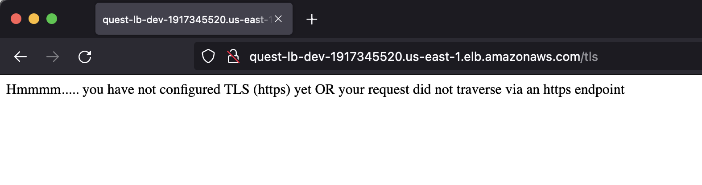

## This is a deployment solution to Rearc's "Quest" application

### Architecture:
 The app is packaged into a container, pushed into dockerhub registry then deploy on AWS ECS Fargate.
 An application load balancer is registered to the ECS Service with the service endpoint URL available to end-users.

### Prerequisites to deploy the stack:
 - an AWS account
 - Terraform CLI v1.2 or latest
 - AWS CLI v2.0 or lastest

### How to deploy:

 - Clone this repository and cd into root directory
 - `$ cd infra && terraform init`  
**Note**: Remote Backend has not been configured, so the state will be managed locally
 - `$ terraform workspace new <your-workpace-name>`
 - `$ terraform plan` (this will output the resources that are about to be deployed)
 - `$ terraform apply`  
    Look in console output for the URL endpoints for the application

### Endpoints Screenshots:

 - /
   
 - /docker
   
 - /secret_word
   
 - /aws
    

 - /loadbalanced
   
 - /tls
   **note**: TLS hasn't been configured yet (TODO)
   

### Improvements:

Given more time I would add a CI/CD pipeline using AWS CodePipeline, AWS Codebuild and AWS CodeDeploy  
to automate the deployment of this application